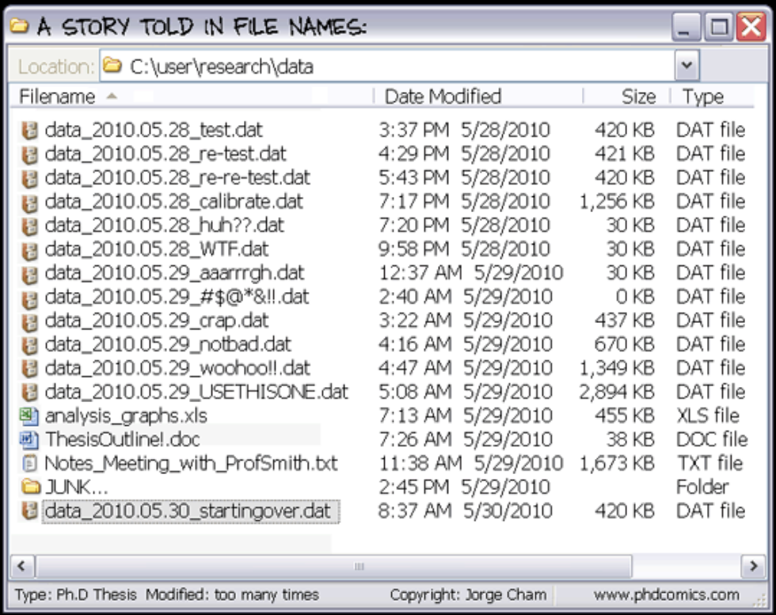
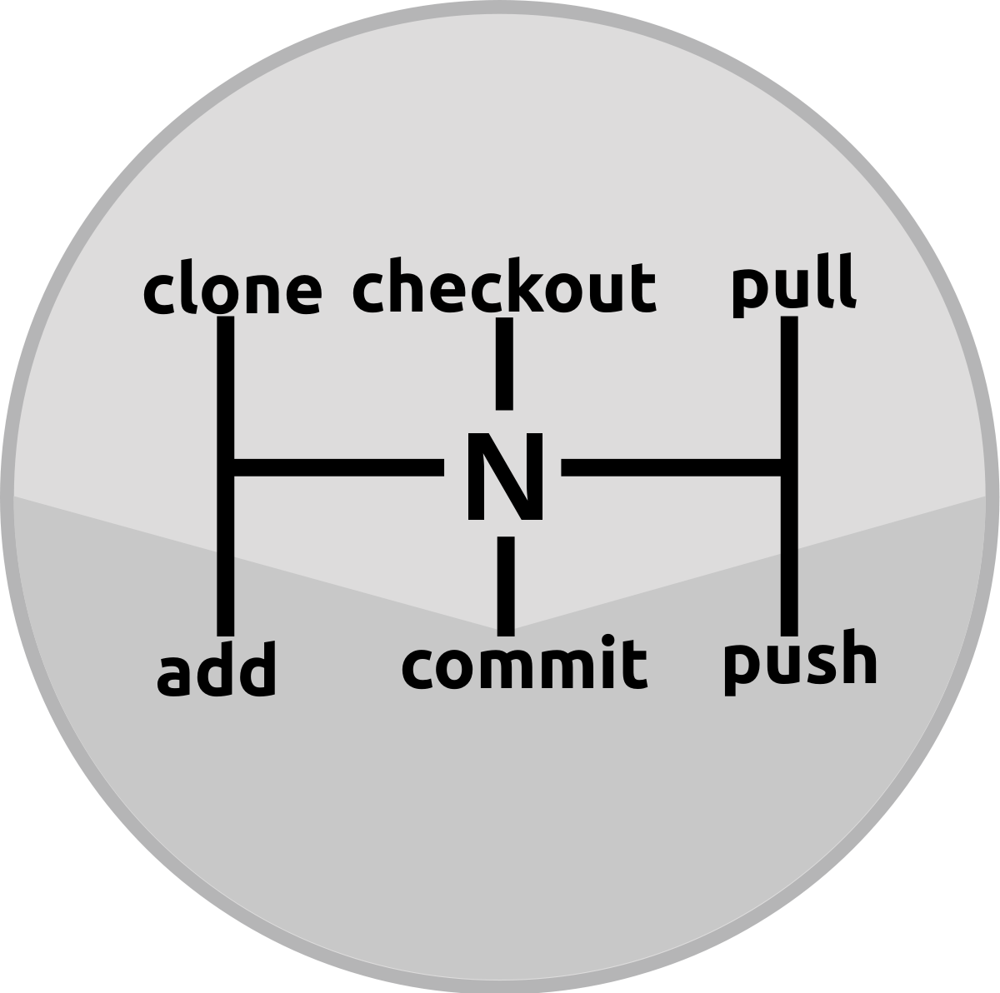
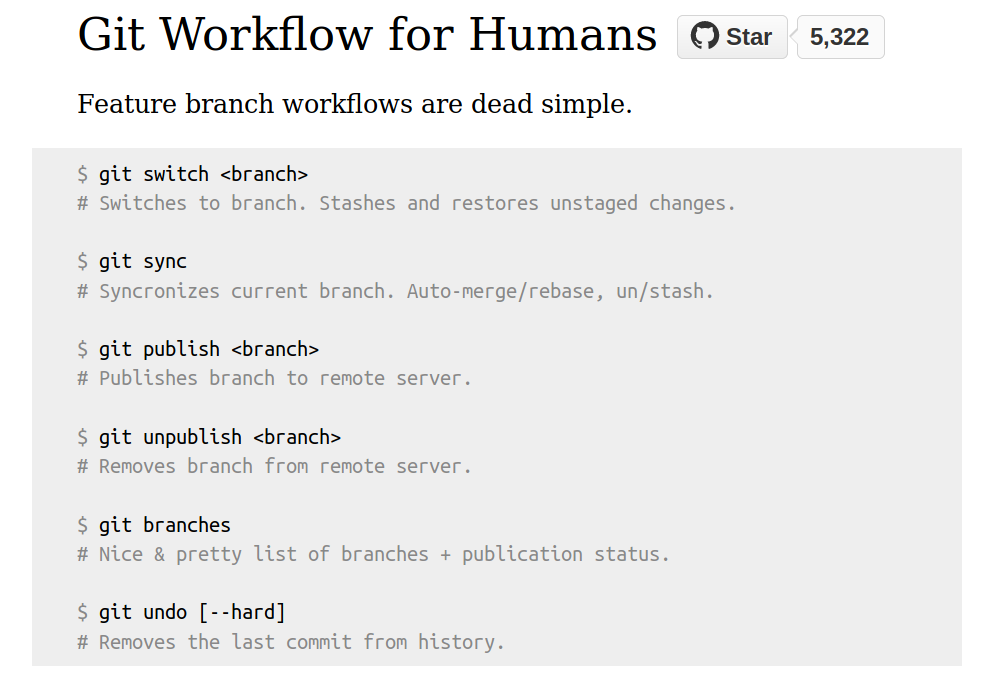
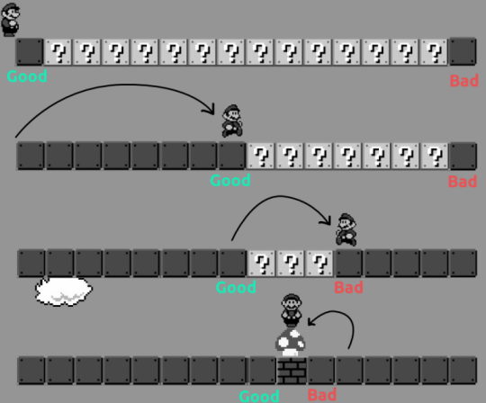
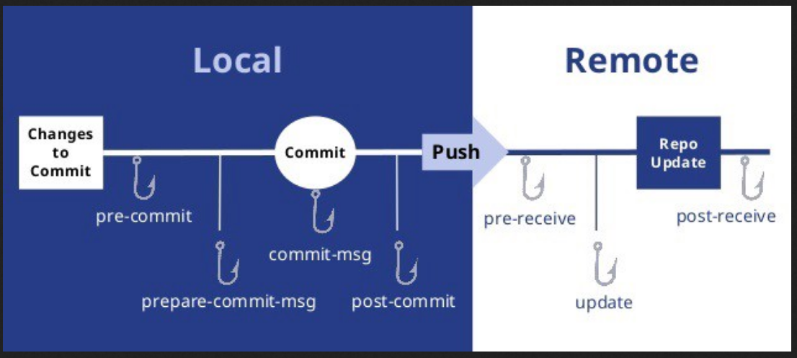

# Introduction

Hello and welcome to this workshop on less-known useful features of Git. We, developers use Git every day, therefore it makes sense to learn it inside out. What I discovered, however, as soon as one grasps the basics, the motivation to learn fades. It's akeen to moving to a new city, for the first few weeks you explore it, but later you get caught into your home-work-supermarket routine. Today I will be your guide, so seat back and enjoy the ride. The goal of this workshop is to explore less known corners of Git that can make your day-to-day work with Git more productive and fun.

If you have ever talked version control to non-developers, you know how difficult it is to convince them to use version control instead of saving file copies with increasingly cryptic names.



Even the basics of Git feel unnecessarily complicated, as if it were made by the creator of Linux or something. However after you learn the main commands, you are good to go.



One one hand, If you want to see how deep the rabbit hole goes you can read the official Git bible, available for free at https://git-scm.com/book/


This book covers almost all the useful features for both Git users and admins.


On the other hand, if you want to be a happier person, you can instead look at project Legit, it wraps the common branch workflow into just 7 commands



So let's get started!

# Configuration

The fastest and most rewarding trick is to configure your Git.

All of the configuration is done with `git config` command and one of 3 flags:

* `--system` for all users (`/etc/gitconfig`)
* `--global` just for you (`/home/%username%/.gitconfig`)
* `--local` just for the current Git project (`.../project/.git/config`)

In real life, however, only `--global` and `--local` configurations are useful.

## Aliases

One of the most time-saving configurations is aliases. If you find yourself typing or tab-completing the same command every day and it's longer than 3 keystrokes, aliases come to the rescue.

Here are 3 examples of such aliases:

```bash
sudo git config --system alias.co checkout
git config --global alias.lg "log --graph --pretty=format:'%Cred%h%Creset -%C(yellow)%d%Creset %s %Cgreen(%cr) %C(bold blue)<%an>%Creset' --abbrev-commit --date=relative"
git config --local alias.pod "pull origin dev"
```

* The first one allows any user on the host to type `git co` instead of `git checkout`
* The second command provides a colourful replacement for a rather verbose default output of `git log`
* The third command is specific to the Sportamore project where all the branches pull changes from `origin dev`

As expected, each alias is written to one of the three configuration files:

```bash
less /etc/gitconfig
less ~/.gitconfig
less ~/sportamore/sportamore/.git/config
```

```bash
git config --global alias.whatsup "for-each-ref --sort=-committerdate --format='%(committerdate:short) %(refname:short) %(authorname)'"
git fetch
git whatsup | head
```

## Aside: Sexy Bash Prompt

If you use `git status` too often, you may want to look at [Sexy Bash Prompt](https://github.com/twolfson/sexy-bash-prompt)


It shows the currently checked out branch and an icon for unpushed/unpulled/uncommited changes.

## Autocorrect


```bash
# reset to no autocorrect
git config --global help.autocorrect 0
```

One thing that I like about Git is that it offers suggestions when it cannot understand a command.

```
git heckout
```

You can take it one step further and allow Git to automatically correct you if there is only one similar command

```bash
git config --global help.autocorrect 30
```

30 in this command means that you have 3 seconds to

* think why are your fingers so fat and clumsy
* cancel the autocorrected command

So let's see how it works

```bash
git heckout
```

Notice that `git sta` is not autocorrected because it is ambiguous.

## Colors

This configuration tip is useful you work a lot in the command line mode. Any colored output in Git can be configured, for example:

```
git config --global color.diff.new "green normal reverse"
```

# Find bugs with git-bisect



While you were on vacation someone created a bug. Instead of "Hello World!" the main page shows "¡Hola, mundo!".

Like with many things in Git, you only need a few subcommands to work.  They are

* `start`
* `bad`
* `good`

```bash
git-bisect start
cat bisect/index.html  # has mundo
git bisect bad
git checkout 41ff7
cat bisect/index.html  # has World
git bisect good
```

Let's automate the search. Enter `git bisect run my_script arguments`
The script should return:

* 0 for good
* 1 for bad
* 125 for cannot test

```
git bisect bad
git bisect good 41ff7
git bisect run ./bisect_test_.sh
```

Notes from documentation:
* As an alternative, you can use `new` instead of `bad` and `old` instead of good
* In real world not every commit can be tested, e.g. build fails. You have Options
  - `git reset --hard HEAD~3`  # try 3 commits ago
  - `git bisect skip`  # current commit
  - `git bisect skip v2.5..v2.6`  # skip a range of commits
* Narrow down to directories
* Give more than one good commit
* Automatically bisect a broken test


# [Sausage Making](https://sethrobertson.github.io/GitBestPractices/#sausage)
Git users have 2 extreme approaches to pushing. The first one says that you should push your commits the way they are with all the swearing, commits that fix typos, drive-by refactoring, people don't care how the sausages are made as long as they are tasty. The other approach is to spend time on post-production, so that commits look as if they were perfect from the start. As with most practical matters, you need to find a balance. Balance in this case is to put effort only where people actually look, that is Pull Requests.

## Separate Branch for refactoring


One of my sins is that my pull requests contain both the payload and refactoring. I found a good solution to create 2 branches and 2 Pull Requests

* `feature/XXX-666-refactoring` -> `dev`
* `feature/XXX-666` -> `feature/XXX-666-refactoring`


## Patch-flag
If separating refactoring and feature intent sounds like an overkill to you, you can separate the changes on commit-level with `-p` flag.
Let's say that a file you were working has more than one logical change, for example refactoring and the actual feature.

_demo/patch.sh__

# Binary files

Git is good at tracking changes in text files and for binary files it simply tells:

```
diff --git a/binary/notes.docx b/binary/notes.docx
index 638f1d4..9934c87 100644
Binary files a/binary/notes.docx and b/binary/notes.docx differ
```

So, for Git all files are either textual with nice diffs or binary blobs that cannot be diffed.


The real world, as usual, is not black and white. Some text files, are better to be treated as binary, for example auto-generated XML configuration. And some binaries are actually just text trapped inside a proprietory format, like Microsoft Word or Excel. Let's look at both scenarios.

## When text should be treated as binary

> "Some languages can be read by human, but not by machines, while others can be read by machines but not by humans. XML solves this problem by being readable to neither."

File `binary/ugly.xml` is a huge line of generated XML. When a single letter changes the diff shows the whole file. Good luck figuring out what has changed. Of course, we could prettify it and try to see the difference, but there is another way. We can tell Git to treat it as binary and not to bother showing the diff.

## other ways to confront
* git diff --word-diff
* add a filter for saving formatted

## When binary should be treated as text

```
sudo apt install pandoc
git config diff.word.textconv "pandoc -t markdown -s"
git diff
```

```
# .gitattribute
*.xml binary
*.docx diff=word
```

And voilà! The Word document diff shows as markdown. Now, when you read `binary files differ` or see a huge and useless diff you know how to change that.

## Filters, Smudge, and Clean


```
*.py filter=pep8
git config --global filter.pep8.clean autopep8
git config --global filter.pep8.smudge cat
```

* store Word documents as Markdown
* Add meta-attributes to checked-out file
  - $ident$
* lint on `add`
  * filters are assumed to be nice-addons, add `required` attribute otherwise
    - [transparent encryption](https://gist.github.com/sandeepraju/4934282f5f87c83ddd93)

# Git Hooks
In almost any collaborative coding project there are rules. These rules can be about code style, commit message format, who can edit which files and so on. Many of these rules are so simple that a robot can do it. And it should. That's where Git hooks step in. There are 2 types of hooks:

* Server Side - are actually enforced
* Client Side - in client's control



Can be bypassed with `--no-verify`
A good way to avoid committing sensitive info: add hook to disallow `#FIXME`

# Correcting Mistakes

## Amend

* complete control over the most recent commit
  - change message
  - change content


## Interactive Rebase

```bash
cd ~/Desktop
mkdir rebasing-exercise
cd rebasing-exercise
git init
echo "hello" > hello.txt
git commit -am 'initial commit'
echo "#TODO add world" >> hello.txt
git commit -am 'add implementation notes'
echo "hello wrold" > hello.txt
git commit -am 'implement hello world'
echo "hello world" > hello.txt
git commit -am 'typo'
echo "Hello World!" > hello.txt
git commit -am 'formatting'
echo "¡Hola, mundo!" > hello.txt
git commit -am 'translate to Spanish'
# assuming no pushes
git rebase -i HEAD~5
```

## DROPPED: Finding lost work

The only 2 actions that may make you lose work are
* hard-reset
* checkout -- file

One awesome thing about git is how forgiving it is until the moment you push your changes. 
- 

* http://sethrobertson.github.io/GitFixUm/fixup.html

## DROPPED: Nuke big files/passwords

```
git verify-pack -v .git/objects/pack/pack-*.idx |
grep blob | sort -k3nr | head |
while read s x b x; do
  git rev-list --all --objects | grep $s |
    awk '{print "'"$(numfmt --to=iec-i --suffix=B --padding=7 $b)"'",$0;}';
    done
```


# Archeology

https://jfire.io/blog/2012/03/07/code-archaeology-with-git/

Often when reading code one can wonder who wrote this and what were they ~~smoking~~ thinking. Luckily, Git records a lot of history and we can do some archaeology to figure out why is the code the way it is. Let's see what is in our archeology toolbox.

## Git grep
The first tool to use when looking for usages in the current codebase is `git-grep`. It is better than the default `grep` because it's faster and has useful flags.

_grep.sh_


## Git blame

When it comes to code archeology, `git blame` (known as Annotate to JetBrains IDE users) is the first tool. It shows the commit, author, and date for every line of code in a given file. As soon as we see the commit hash next to the line, we inspect this commit with

```
git show {commit hash}
```

This way we see what was the intent of this commit and what else had changed at the same time. Often we hit refactoring commits, so that's why it's important to clearly write in the commit message that this commit is refactoring.

Useful flags
```bash
$ git blame -w  # ignores white space
$ git blame -M  # ignores moving text
$ git blame -C  # ignores moving text into other files
```

## Pickaxe
Pickaxe is another name for `git log -S {string}` that searches for all occurences of a string across the whole history. The usual flow is to look for string and then explore individual commits on why did they include this string.

_archeology.sh_

# Miscellaneous Tips
* switch to previous branch with `-`, also works with `merge`
* delete already merged branches

```bash
git checkout master
git branch --merged
git branch --no-merged
git branch --merged | xargs git branch -d
```

* See what's shaking with `git for-each-ref --sort=-committerdate --format='%(refname:short) %(committerdate:short)'`
* instantaneously checkout file from another revision/branch with `--`
```
git checkout feature/SPORT-625 -- manage.py
git checkout 34201f7dab8 -- manage.py
git checkout -p  592a12ed1e^ -- sportamor/site/apiviews/base.py
```
* search ref-log with
```
git log -g
```

* git-stash
  - name stash always `git stash save "Jim asked to fix FOO while I was doing BAR"`

* word-diff
```
git diff --word-diff
```

* auto-rebase
```
git config branch.dev.rebase true
git config --global branch.autosetuprebase always
```

* git replace `git grep -l $1 | xargs sed -i 's/$1/$2/g'`

* follow file changes `git log --follow -p -- index.html`

# Conclusion

I hope that this talk showed you some topics that are interesting to you.

Pro Git in Russian

* https://git-scm.com/book/ru/v2
* Git tips and tricks

---

# Reading list
* https://git-scm.com/docs/gitattributes
* https://opensource.com/article/18/4/git-tips
  - 6. A nicer force-push: `git push --force-with-lease`
* short commands description in Pro Git appendix

# Ideas pool

* squash
* time-based revision references  `git diff HEAD@{'2 months ago'}`
* ancestry path
* git log --stat  # to see changed files
* commits path shortcuts ..., ^, HEAD
* git stash
  - basic stash only for few-minute switches
  - name stash always `git stash save "Jim asked to fix FOO while I was doing BAR"`
  - pop stash into a branch ?
* delete branch locally and remotely
* https://devhints.io/git-log-format git log --pretty=format:"%ad - %an: %s %H" --after="2019-02-25" --until="2019-02-27"

# from Gmail
Git whatchanged
https://github.com/git-tips/tips/blob/master/README.md#find-out-branches-containing-commit-hash
Stash untracked
Stash all
Fixup, autosquash
https://github.com/git-tips/tips/blob/master/README.md#remove-entry-in-the-global-config
https://github.com/git-tips/tips/blob/master/README.md#remove-entry-in-the-global-config
https://github.com/git-tips/tips/blob/master/README.md#logs-between-date-range
https://github.com/git-tips/tips/blob/master/README.md#logs-between-date-range
